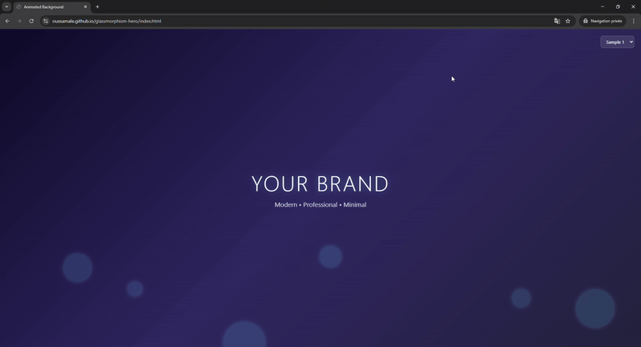
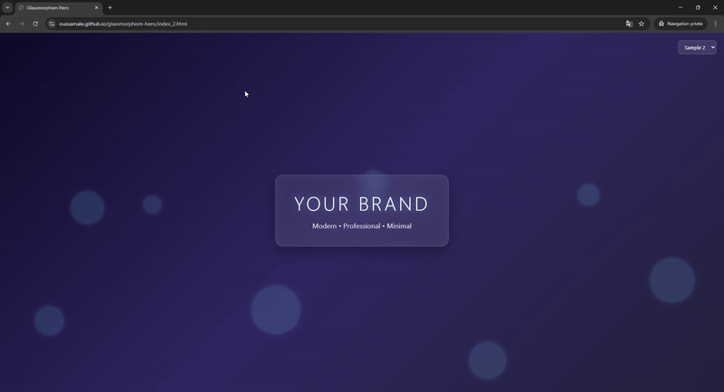

# Glassmorphism Animated Hero Section


A modern and minimal **animated hero section** with glassmorphism and floating bubble effects, built using **HTML** and **CSS**. This project is perfect for websites, landing pages, or portfolios that want a sleek, futuristic design.


---

## Demo

| Sample 1 | Sample 2 |
|---------|----------|
|  |  |


## Live Demo
You can check out the animated hero section in action [here](https://oussamale.github.io/glassmorphism-hero/).

---

## Features

- **Glassmorphism Card**: Centered card with blur and semi-transparent background.
- **Animated Background**: Floating bubbles with smooth rotation and opacity effects.
- **Responsive Design**: Works well on different screen sizes.
- **Theme Variations**: Two sample layouts:
  - **Sample 1**: Floating text content over animated background.
  - **Sample 2**: Glassmorphism card with text.
- **Dropdown Navigation**: Easily switch between samples with a styled select dropdown.

---

## Installation

1. Clone the repository:

```bash
git clone https://github.com/oussamale/glassmorphism-hero.git
````

2. Navigate to the project folder:

```bash
cd glassmorphism-hero
```

3. Open `index.html` or `index_2.html` in your browser to see the animation.

---

## Usage

* Customize the **text** inside the `<h1>` and `<p>` tags to your brand.
* Modify **bubble sizes, colors, and animation speed** by editing `style.css`.
* The glass card can be resized or restyled by adjusting `.glass-card` CSS.

---

## Files Structure

```
glassmorphism-hero/
│
├─ index.html           # Sample 1 - Minimal animated background
├─ index_2.html         # Sample 2 - Glassmorphism hero layout
├─ style.css            # Main CSS file
├─ README.md            # Project documentation
└─ assets/
   └─ images/
      ├─ sample1.gif    # GIF preview for Sample 1
      └─ sample2.gif    # GIF preview for Sample 2

```

---

## Customization Tips

* **Background Gradient**: Change `.animation-area` linear-gradient colors.
* **Bubble Animations**: Adjust `@keyframes animate` or bubble `li` sizes/durations for different effects.
* **Glass Card**: Modify `backdrop-filter`, `border`, or `box-shadow` for stronger or subtler glassmorphism effect.

---

## License

This project is open source and available under the [MIT License](LICENSE).

---

